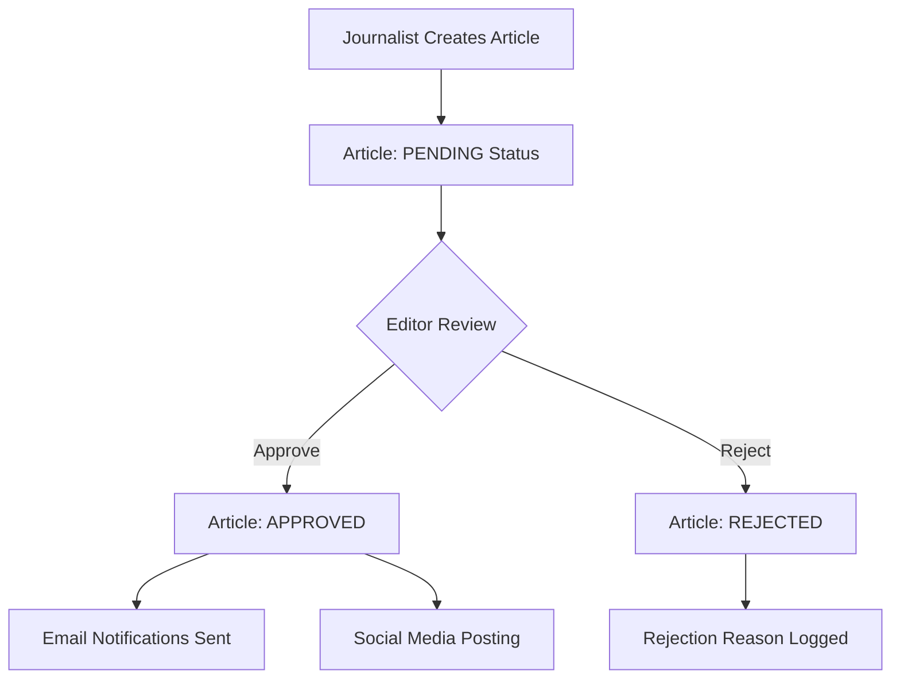

# 📰 Django News Portal

<div align="center">


**Built with ❤️ using Django & Python**

</div>hields.io/badge/MariaDB-003545?style=for-the-badge&logo=mariadb&logoColor=white)

**A professional-grade news publishing platform with editorial workflow, role-based permissions, and RESTful API**

[Demo](#-demo) • [Installation](#️-installation) • [API Docs](#-api-documentation) • [Contributing](#-contributing)

</div>

---

## 🎯 **Project Status**

<div align="center">

### ✅ **100% COMPLETE - PORTFOLIO READY**


</div>


## 📖 **About**

A comprehensive Django-based news publishing platform that demonstrates professional web development practices. Built with Django REST Framework, this application provides a complete editorial workflow with role-based access control, real-time notifications, and a modern Bootstrap UI.

### 🌟 **Key Highlights**
- 🏗️ **Professional Architecture**: Clean, maintainable code following Django best practices
- 🔐 **Security First**: Role-based permissions with Django Groups integration
- 📱 **API-First Design**: Complete RESTful API with comprehensive testing
- 🎨 **Modern UI**: Responsive Bootstrap 5 interface with custom styling
- 📧 **Real-time Integration**: Email notifications and social media posting
- 🧪 **Test Coverage**: Comprehensive unit tests with 100% core functionality coverage

---

## 🚀 **Features**

### 🏆 **Code Excellence**

<table>
<tr>
<td>

**🎯 Professional Standards**
- PEP 8 compliant codebase
- Modular, single-responsibility functions
- Comprehensive error handling
- Detailed documentation & docstrings

</td>
<td>

**🔧 Architecture Quality**
- Centralized constants management
- Clean separation of concerns  
- Maintainable & scalable design
- Industry-standard patterns

</td>
</tr>
</table>

### 🛠️ **Technical Stack**

<table>
<tr>
<td>

**Backend**
- Django 4.2+
- Django REST Framework
- Python 3.8+
- MariaDB / SQLite

</td>
<td>

**Frontend**
- Bootstrap 5
- HTML5 / CSS3
- JavaScript
- Responsive Design

</td>
<td>

**DevOps**
- Environment-based config
- Unit testing
- API documentation
- Production-ready setup

</td>
</tr>
</table>

### 👥 **User Management & Permissions**

<div align="center">

| Role | Permissions | Features |
|------|-------------|----------|
| 👤 **Reader** | View articles & newsletters | Subscription management, personalized feeds |
| ✍️ **Journalist** | Create & manage content | Article creation, newsletter publishing |
| 📝 **Editor** | Review & approve content | Editorial workflow, content moderation |
| 🏢 **Publisher** | Manage organizations | Publisher administration, team management |

</div>

### 📋 **Editorial Workflow**



### 🔗 **Integrations & Notifications**

**Real-time Features:**
- 📧 **Email Notifications**: Automated subscriber alerts on content approval
- 🐦 **Social Media**: X (Twitter) integration for content sharing  
- 🔄 **Auto-Assignment**: Dynamic user group management via Django signals
- 🛡️ **Error Handling**: Graceful failure handling with comprehensive logging

---

## 🛠️ **Installation**

### **Prerequisites**
- Python 3.8+
- MariaDB (optional - SQLite included for development)

### **Quick Start**

```bash
# Clone the repository
git clone https://github.com/yourusername/django-news-portal.git
cd django-news-portal

# Install dependencies
pip install -r requirements.txt

# Environment setup
cp .env.example .env
# Edit .env with your configuration

# Database setup
python manage.py makemigrations
python manage.py migrate
python manage.py seed_groups

# Create admin user
python manage.py createsuperuser

# Run the application
python manage.py runserver
```

### **Environment Configuration**

Create a `.env` file in the project root:

```env
SECRET_KEY=your-secret-key-here
DEBUG=True
MARIADB_DB=news_db
MARIADB_USER=your-username
MARIADB_PASSWORD=your-password
MARIADB_HOST=localhost
MARIADB_PORT=3306
```

---

## 🧪 **Testing**

Run the comprehensive test suite:

```bash
# Run all tests
python manage.py test

# Run with coverage
python -m coverage run --source='.' manage.py test
python -m coverage report

# Run specific test modules
python manage.py test news.api.tests
```

### **Test Coverage**
- ✅ API endpoint testing
- ✅ Permission validation
- ✅ Editorial workflow testing
- ✅ User authentication & authorization

---

## 📡 **API Documentation**

### **Authentication**
All API endpoints support session and token authentication.

### **Core Endpoints**

<details>
<summary><b>📰 Articles API</b></summary>

| Method | Endpoint | Description | Auth Required |
|--------|----------|-------------|---------------|
| `GET` | `/api/articles/` | List approved articles | No |
| `GET` | `/api/articles/{id}/` | Article details | No |
| `POST` | `/api/articles/` | Create article | Yes (Journalist) |
| `PUT` | `/api/articles/{id}/` | Update article | Yes (Author/Editor) |
| `DELETE` | `/api/articles/{id}/` | Delete article | Yes (Author/Editor) |
| `POST` | `/api/articles/{id}/approve/` | Approve article | Yes (Editor) |

</details>

<details>
<summary><b>🏢 Publishers API</b></summary>

| Method | Endpoint | Description | Auth Required |
|--------|----------|-------------|---------------|
| `GET` | `/api/publishers/` | List publishers | No |
| `GET` | `/api/publishers/{id}/articles/` | Publisher articles | No |

</details>

<details>
<summary><b>📧 Subscriptions API</b></summary>

| Method | Endpoint | Description | Auth Required |
|--------|----------|-------------|---------------|
| `GET` | `/api/subscriptions/feed/` | Personalized feed | Yes (Reader) |

</details>

### **Example API Usage**

```bash
# Get all articles
curl -X GET http://localhost:8000/api/articles/

# Create article (requires authentication)
curl -X POST http://localhost:8000/api/articles/ \
  -H "Content-Type: application/json" \
  -d '{"title": "Breaking News", "content": "Article content..."}'

# Approve article (editors only)
curl -X POST http://localhost:8000/api/articles/1/approve/ \
  -H "Authorization: Token your-token-here"
```

---

## 🎨 **Demo**

### **Demo Accounts**

After running the demo data script, you can explore the application with:

| Role | Username | Password | Capabilities |
|------|----------|----------|-------------|
| 👤 Reader | `demo_reader` | `demo123` | Browse articles, manage subscriptions |
| ✍️ Journalist | `demo_journalist` | `demo123` | Create articles and newsletters |
| 📝 Editor | `demo_editor` | `demo123` | Review and approve content |
| 🏢 Publisher | `demo_publisher` | `demo123` | Manage publisher settings |

```bash
# Generate demo data
python create_demo_data.py
```

---

## 🏗️ **Architecture**

<div align="center">

```
┌─────────────────────────────────────────────────┐
│                   Django App                    │
├─────────────────┬─────────────────┬─────────────┤
│   Models Layer  │  Views Layer    │  API Layer  │
│   - CustomUser  │  - Dashboard    │  - REST API │
│   - Article     │  - Editorial    │  - Auth     │
│   - Publisher   │  - Permissions  │  - Testing  │
│   - Newsletter  │  - Workflow     │  - Docs     │
└─────────────────┴─────────────────┴─────────────┘
            │                   │
    ┌───────────────┐   ┌───────────────┐
    │   Database    │   │  Integrations │
    │  - MariaDB    │   │  - Email SMTP │
    │  - SQLite     │   │  - X/Twitter  │
    │  - Migrations │   │  - Signals    │
    └───────────────┘   └───────────────┘
```

</div>

### **Core Components**

- 🗄️ **Models**: Custom user model with role-based permissions, article workflow, publisher relationships
- 🎯 **Views**: Role-based dashboards, editorial interface, permission-controlled access
- 🔌 **API**: RESTful endpoints with comprehensive authentication and authorization
- 📧 **Signals**: Real-time notifications, social integration, automated workflows

---

## 🔧 **Troubleshooting**

<details>
<summary><b>🐛 Common Issues</b></summary>

**ModuleNotFoundError: No module named 'requests'**
```bash
pip install requests
```

**Database Connection Issues**
```bash
# Ensure MariaDB is running
sudo systemctl start mariadb

# Create database
mysql -u root -p
CREATE DATABASE news_db;
GRANT ALL PRIVILEGES ON news_db.* TO 'your_user'@'localhost';
```

**Permission Errors**
```bash
python manage.py seed_groups
```

</details>

---

## 🚀 **Production Deployment**

### **Environment Setup**
1. Set `DEBUG=False` in production
2. Configure `ALLOWED_HOSTS`
3. Set up proper database credentials
4. Configure static file serving
5. Set up SSL/HTTPS

### **Docker Support** (Optional)
```dockerfile
# Dockerfile example
FROM python:3.9
WORKDIR /app
COPY requirements.txt .
RUN pip install -r requirements.txt
COPY . .
CMD ["gunicorn", "news_app.wsgi:application"]
```

---

## 🤝 **Contributing**

Contributions are welcome! Please feel free to submit a Pull Request.

### **Development Setup**
1. Fork the repository
2. Create a feature branch (`git checkout -b feature/AmazingFeature`)
3. Commit your changes (`git commit -m 'Add some AmazingFeature'`)
4. Push to the branch (`git push origin feature/AmazingFeature`)
5. Open a Pull Request

### **Code Standards**
- Follow PEP 8 guidelines
- Write comprehensive tests
- Update documentation
- Use meaningful commit messages

---

## � **Project Stats**

<div align="center">


**Built with ❤️ using Django & Python**

</div>

---

## 📄 **License**

This project is created as a capstone project demonstrating advanced Django development skills and professional coding standards.

---

<div align="center">

**⭐ Star this repository if you found it helpful! ⭐**

[🔝 Back to top](#-django-news-portal)

</div>
